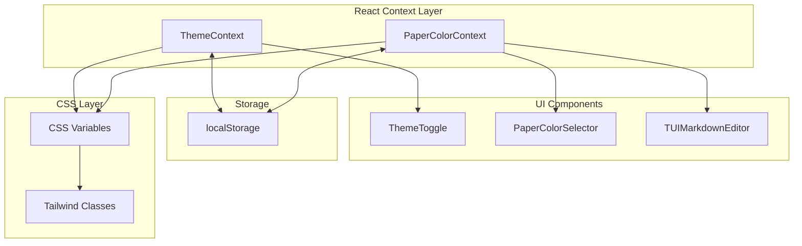

# Design Document: Paper Color Theme

## Overview

本设计为 Markdown 笔记应用添加"纸张颜色"主题功能。该功能允许用户选择不同的纸张背景色（如护眼黄、复古牛皮纸色等），独立于现有的明暗模式运作。

核心设计原则：
- 与现有 ThemeContext 集成，扩展而非替换
- 使用 CSS 变量实现颜色切换，保持与 Tailwind 兼容
- 每种纸张颜色提供明暗两个变体
- 持久化用户偏好到 localStorage

## Architecture



## Components and Interfaces

### 1. PaperColor 类型定义

```typescript
// src/types/paper-color.ts

export type PaperColorId = 
  | 'default'      // 默认白色/深色
  | 'eye-care'     // 护眼黄
  | 'sepia'        // 复古牛皮纸
  | 'light-blue'   // 淡蓝色
  | 'light-green'; // 淡绿色

export interface PaperColorPreset {
  id: PaperColorId;
  name: string;           // 显示名称的 i18n key
  light: {
    background: string;   // oklch 颜色值
    foreground: string;
    muted: string;
  };
  dark: {
    background: string;
    foreground: string;
    muted: string;
  };
}

export interface PaperColorContextType {
  paperColor: PaperColorId;
  setPaperColor: (color: PaperColorId) => void;
  presets: PaperColorPreset[];
}
```

### 2. PaperColorContext

```typescript
// src/contexts/PaperColorContext.tsx

interface PaperColorProviderProps {
  children: ReactNode;
  defaultColor?: PaperColorId;
}

// 提供的功能：
// - paperColor: 当前选中的纸张颜色 ID
// - setPaperColor: 设置纸张颜色并持久化
// - presets: 所有可用的颜色预设
```

### 3. PaperColorSelector 组件

```typescript
// src/components/PaperColorSelector.tsx

interface PaperColorSelectorProps {
  className?: string;
  variant?: 'dropdown' | 'inline';  // 下拉菜单或内联色块
}

// 功能：
// - 显示颜色色块
// - 当前选中颜色有视觉指示器
// - 支持键盘导航 (Tab, Enter, Arrow keys)
// - 点击即时预览
```

## Data Models

### 纸张颜色预设数据

```typescript
export const PAPER_COLOR_PRESETS: PaperColorPreset[] = [
  {
    id: 'default',
    name: 'paperColor.default',
    light: {
      background: 'oklch(1 0 0)',           // 纯白
      foreground: 'oklch(0.15 0.005 240)',
      muted: 'oklch(0.96 0.005 240)',
    },
    dark: {
      background: 'oklch(0.08 0.015 240)',  // GitHub 深色
      foreground: 'oklch(0.92 0.005 240)',
      muted: 'oklch(0.16 0.02 240)',
    },
  },
  {
    id: 'eye-care',
    name: 'paperColor.eyeCare',
    light: {
      background: 'oklch(0.97 0.03 85)',    // 护眼黄
      foreground: 'oklch(0.2 0.02 60)',
      muted: 'oklch(0.93 0.04 85)',
    },
    dark: {
      background: 'oklch(0.15 0.03 85)',    // 深色护眼
      foreground: 'oklch(0.88 0.02 85)',
      muted: 'oklch(0.2 0.04 85)',
    },
  },
  {
    id: 'sepia',
    name: 'paperColor.sepia',
    light: {
      background: 'oklch(0.95 0.04 60)',    // 牛皮纸色
      foreground: 'oklch(0.25 0.05 45)',
      muted: 'oklch(0.9 0.05 60)',
    },
    dark: {
      background: 'oklch(0.12 0.04 60)',    // 深色牛皮纸
      foreground: 'oklch(0.85 0.04 60)',
      muted: 'oklch(0.18 0.05 60)',
    },
  },
  {
    id: 'light-blue',
    name: 'paperColor.lightBlue',
    light: {
      background: 'oklch(0.97 0.02 230)',   // 淡蓝色
      foreground: 'oklch(0.2 0.03 240)',
      muted: 'oklch(0.93 0.03 230)',
    },
    dark: {
      background: 'oklch(0.12 0.03 230)',   // 深蓝色
      foreground: 'oklch(0.88 0.02 230)',
      muted: 'oklch(0.18 0.04 230)',
    },
  },
  {
    id: 'light-green',
    name: 'paperColor.lightGreen',
    light: {
      background: 'oklch(0.97 0.03 145)',   // 淡绿色
      foreground: 'oklch(0.2 0.04 150)',
      muted: 'oklch(0.93 0.04 145)',
    },
    dark: {
      background: 'oklch(0.12 0.03 145)',   // 深绿色
      foreground: 'oklch(0.88 0.03 145)',
      muted: 'oklch(0.18 0.04 145)',
    },
  },
];
```

### localStorage 键名

```typescript
const STORAGE_KEY = 'notepad-paper-color';
```

## Correctness Properties

*A property is a characteristic or behavior that should hold true across all valid executions of a system—essentially, a formal statement about what the system should do. Properties serve as the bridge between human-readable specifications and machine-verifiable correctness guarantees.*

### Property 1: Color Presets Completeness

*For any* paper color preset in the system, it SHALL have both light and dark variants with valid oklch color values for background, foreground, and muted properties.

**Validates: Requirements 1.1, 1.4**

### Property 2: Color Selection Updates CSS Variables

*For any* paper color selection and any theme mode (light/dark), selecting a paper color SHALL update the document root CSS variables to match the corresponding variant's color values.

**Validates: Requirements 1.2, 2.2, 5.3**

### Property 3: Paper Color Independence from Theme Mode

*For any* sequence of paper color and theme mode changes, the paper color selection SHALL remain unchanged when toggling between light and dark modes, and vice versa.

**Validates: Requirements 1.3**

### Property 4: Persistence Round-Trip

*For any* valid paper color ID, persisting it to localStorage and then restoring it SHALL produce the same paper color ID.

**Validates: Requirements 3.1, 3.2**

### Property 5: Contrast Ratio Compliance

*For any* paper color preset in both light and dark modes, the contrast ratio between foreground and background colors SHALL be at least 4.5:1 (WCAG AA standard).

**Validates: Requirements 4.2**

### Property 6: CSS Variable Naming Convention

*For any* CSS variable defined by the paper color system, the variable name SHALL match the pattern `--paper-{property}` where property is one of: background, foreground, muted.

**Validates: Requirements 5.1, 5.2**

## Error Handling

| Error Scenario | Handling Strategy |
|----------------|-------------------|
| Invalid color ID in localStorage | 回退到 'default' 颜色 |
| localStorage 不可用 | 使用内存存储，不持久化 |
| CSS 变量应用失败 | 记录错误日志，保持当前状态 |
| 颜色预设数据损坏 | 使用硬编码的默认预设 |

## Testing Strategy

### Unit Tests

- 测试 PaperColorContext 的状态管理
- 测试 localStorage 读写功能
- 测试颜色预设数据结构完整性
- 测试 CSS 变量更新逻辑

### Property-Based Tests

使用 fast-check 库进行属性测试：

1. **Property 1**: 生成随机预设索引，验证所有颜色字段存在且格式正确
2. **Property 2**: 生成随机颜色选择序列，验证 CSS 变量正确更新
3. **Property 3**: 生成随机的颜色/主题切换序列，验证独立性
4. **Property 4**: 生成随机颜色 ID，验证存储往返一致性
5. **Property 5**: 对所有预设计算对比度，验证符合 WCAG 标准
6. **Property 6**: 验证所有 CSS 变量名符合命名规范

### Integration Tests

- 测试 PaperColorSelector 组件渲染
- 测试键盘导航功能
- 测试与 ThemeContext 的集成
