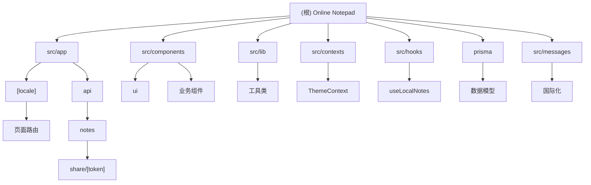

# Online Notepad - AI 项目上下文

## 变更记录 (Changelog)

- **2025-09-01 21:06:33** - 项目架构重大更新：新增专注模式、暗黑模式主题系统、customSlug 自定义链接功能
- **2025-08-30 08:02:13** - 初始化项目 AI 上下文，完成架构分析和文档生成

## 项目愿景

Online Notepad 是一个基于 Next.js 的现代化在线记事本应用，提供简洁、快速、安全的笔记体验。支持多语言（中英文）、笔记分享、专注模式、主题切换等功能，使用 PostgreSQL 作为数据存储，采用现代化的 React 技术栈和 Tailwind CSS 样式框架。

## 架构总览

### 技术栈
- **前端框架**: Next.js 15.5.2 (App Router)
- **UI 库**: React 19.1.0 + Tailwind CSS 4.0
- **组件库**: Radix UI + Lucide React
- **数据库**: PostgreSQL + Prisma ORM
- **国际化**: next-intl
- **表单验证**: Zod
- **开发工具**: TypeScript, ESLint

### 架构特点
- 采用 Next.js App Router 架构
- 支持多语言路由 (`/en/`, `/zh/`)
- RESTful API 设计，支持自定义分享链接
- 响应式设计，移动端友好
- 专注模式，提供无干扰写作体验
- 多主题支持（亮色/暗黑/系统自适应）
- 离线本地存储支持
- 数据库迁移和类型安全

## 模块结构图



## 模块索引

| 模块 | 路径 | 职责 | 语言 | 状态 |
|------|------|------|------|------|
| **前端应用** | `src/` | Next.js 应用主体，包含页面、API、组件 | TypeScript | ✅ 活跃 |
| **数据库模型** | `prisma/` | 数据库 schema 定义和迁移 | Prisma Schema | ✅ 活跃 |
| **静态资源** | `public/` | 图标和静态文件 | - | ✅ 活跃 |
| **文档资料** | `docs/` | 项目文档和策略文件 | Markdown | ✅ 活跃 |

## 核心功能

### 笔记管理
- **创建笔记**: 支持标题和内容编辑
- **自动保存**: 实时本地存储，避免数据丢失
- **笔记列表**: 可搜索的笔记管理界面
- **本地存储**: 使用 localStorage 实现离线功能

### 分享功能
- **公开分享**: 生成安全的分享令牌
- **自定义链接**: 支持用户自定义 URL 后缀 (customSlug)
- **链接唯一性**: 自动检查和防止链接冲突
- **分享控制**: 可切换笔记的公开/私有状态

### 用户体验
- **专注模式**: 全屏无干扰的写作环境，支持 ESC 键快速退出
- **主题系统**: 亮色/暗黑/系统自适应三种模式
- **多语言**: 中英文界面切换
- **响应式设计**: 移动端和桌面端适配

## 运行与开发

### 本地开发
```bash
# 安装依赖
npm install

# 启动开发服务器（使用 Turbopack）
npm run dev

# 构建生产版本
npm run build

# 启动生产服务器
npm start

# 代码检查
npm run lint
```

### 环境要求
- Node.js 20+
- PostgreSQL 数据库
- 环境变量: `DATABASE_URL`

### 数据库操作
```bash
# 同步数据库模式
npx prisma db push

# 生成客户端
npx prisma generate

# 查看数据库
npx prisma studio
```

## 测试策略

**当前状态**: ⚠️ 暂无测试文件
- 建议添加单元测试 (Jest + Testing Library)
- API 接口测试
- 组件测试（特别是专注模式和主题切换）
- E2E 测试 (Playwright)

### 建议测试重点
- 专注模式的键盘交互
- 主题切换逻辑
- 自定义链接验证
- 国际化文本渲染
- 本地存储持久化

## 编码规范

- **代码风格**: ESLint + Prettier (建议配置)
- **TypeScript**: 严格模式，完整类型定义
- **组件**: 功能组件 + React Hooks
- **样式**: Tailwind CSS utilities-first
- **API**: RESTful 设计，Zod 数据验证
- **数据库**: Prisma ORM，类型安全查询
- **状态管理**: React Context + custom hooks

## AI 使用指引

### 代码修改建议
1. **API 路由**: 在 `src/app/api/` 下添加新的端点
2. **页面组件**: 使用 App Router 约定，支持国际化
3. **UI 组件**: 扩展 `src/components/ui/` 下的基础组件
4. **数据模型**: 修改 `prisma/schema.prisma` 后需要重新生成客户端
5. **主题功能**: 通过 `ThemeContext` 管理主题状态
6. **专注模式**: 在需要无干扰体验的组件中集成专注模式

### 常见任务
- 添加新页面: 在 `src/app/[locale]/` 下创建路由文件
- 新增 API: 在 `src/app/api/` 下添加 `route.ts`
- 数据库修改: 更新 schema 并运行 `prisma db push`
- 样式调整: 使用 Tailwind 类名，保持响应式设计
- 主题支持: 使用 CSS 变量和 `dark:` 前缀
- 翻译文本: 在 `src/messages/{locale}.json` 中添加键值对

### 注意事项
- 所有用户界面文本需要国际化处理
- API 接口需要适当的错误处理
- 数据库操作要考虑并发和事务安全
- 分享功能涉及安全令牌，注意权限控制
- 自定义链接需要唯一性验证
- 专注模式下的键盘事件要正确处理
- 主题切换需要考虑系统偏好设置的监听

## 最新更新亮点

### 专注模式 (Focus Mode)
- 全屏编辑体验，隐藏所有干扰元素
- ESC 键快捷退出
- 专用的键盘快捷键提示

### 主题系统 (Theme System)
- 亮色、暗黑、系统自适应三种模式
- 持久化用户偏好设置
- 动态监听系统主题变化
- 平滑的主题切换动画

### 自定义分享链接 (Custom Slug)
- 用户可自定义分享 URL 后缀
- 自动检查链接唯一性
- 支持字母、数字、连字符和下划线
- 优雅的冲突处理机制