# CLAUDE.md

This file provides guidance to Claude Code (claude.ai/code) when working with code in this repository.

## 变更记录 (Changelog)

### 2025-09-03 20:28:21
- **架构师初始化完成**: 自适应扫描策略覆盖 52/65 文件 (80%)
- **模块结构图生成**: 添加 Mermaid 交互式架构图
- **索引系统建立**: 生成 `.claude/index.json` 完整项目索引
- **覆盖率报告**: 识别 9 个主要模块，完整扫描 7 个核心模块
- **技术债务评估**: 标识关键缺口（测试、安全、性能优化）

---

## 项目愿景

Online Notepad 旨在成为最简洁高效的在线记事本应用，专注于 Markdown 编辑体验、多语言支持和无干扰的写作环境。采用现代 Web 技术栈，提供桌面级编辑体验的同时保持轻量快速。

## 架构总览

### 技术选型哲学
- **现代化优先**: Next.js 15 + React 19 前沿版本
- **类型安全**: TypeScript 严格模式全覆盖  
- **性能优先**: Turbopack 构建 + 组件懒加载
- **用户体验**: 响应式设计 + PWA 就绪
- **国际化**: next-intl 完整 i18n 解决方案

### 核心技术栈
- **前端框架**: Next.js 15.5.2 (App Router) + React 19.1.0
- **类型系统**: TypeScript 严格模式 + Zod 运行时验证
- **样式方案**: Tailwind CSS 4.0 + Radix UI + 自定义设计系统
- **数据持久化**: PostgreSQL + Prisma ORM 6.15.0
- **国际化**: next-intl 支持中英文路由
- **Markdown**: @uiw/react-md-editor + KaTeX 数学公式
- **状态管理**: React Context + 自定义 Hooks

### 模块结构图

```mermaid
graph TD
    A["🏠 online-notepad<br/>根目录"] --> B["📱 src/app<br/>Next.js 路由层"];
    A --> C["🎨 src/components<br/>React 组件库"];
    A --> D["🛠 src/lib<br/>核心工具库"];
    A --> E["🌐 src/i18n<br/>国际化模块"];
    A --> F["🎣 src/hooks<br/>React Hooks"];
    A --> G["🗃 prisma<br/>数据库模块"];
    A --> H["🌍 public<br/>静态资源"];

    B --> B1["[locale]/page.tsx<br/>主应用页面"];
    B --> B2["api/notes/<br/>RESTful API"];
    B --> B3["middleware.ts<br/>国际化中间件"];

    C --> C1["NewMarkdownEditor.tsx<br/>编辑器核心"];
    C --> C2["NoteList.tsx<br/>笔记列表"];
    C --> C3["ui/<br/>基础组件"];

    D --> D1["prisma.ts<br/>数据库客户端"];
    D --> D2["utils.ts<br/>通用工具"];

    G --> G1["schema.prisma<br/>数据模型"];
    G --> G2["migrations/<br/>数据库版本"];

    click B "./src/app/CLAUDE.md" "查看 App Router 模块文档"
    click C "./src/components/CLAUDE.md" "查看组件库模块文档"
    click D "./src/lib/CLAUDE.md" "查看工具库模块文档"
    click E "./src/i18n/CLAUDE.md" "查看国际化模块文档"
    click F "./src/hooks/CLAUDE.md" "查看 Hooks 模块文档"
    click G "./prisma/CLAUDE.md" "查看数据库模块文档"
```



## 模块索引

| 模块 | 路径 | 类型 | 责任描述 | 入口文件 | 状态 |
|------|------|------|----------|----------|------|
| **App Router 层** | `src/app/` | Next.js 路由 | 页面路由、API 端点、中间件 | `[locale]/page.tsx` | ✅ 完整 |
| **React 组件库** | `src/components/` | UI 组件 | 编辑器、列表、对话框、工具栏 | `NewMarkdownEditor.tsx` | ✅ 完整 |
| **核心工具库** | `src/lib/` | 工具函数 | 数据库连接、通用工具 | `prisma.ts` | ✅ 完整 |
| **国际化模块** | `src/i18n/` | i18n 配置 | 多语言路由、消息管理 | `config.ts` | ✅ 完整 |
| **React Hooks** | `src/hooks/` | 自定义 Hook | 本地存储、状态管理 | `useLocalNotes.ts` | ✅ 完整 |
| **Context 管理** | `src/contexts/` | React Context | 主题状态、全局状态 | `ThemeContext.tsx` | ✅ 完整 |
| **类型定义** | `src/types/` | TypeScript | 接口、类型、模式配置 | `note-modes.ts` | ✅ 完整 |
| **数据库模块** | `prisma/` | 数据库 ORM | 模式定义、迁移管理 | `schema.prisma` | ✅ 完整 |
| **静态资源** | `public/` | 静态文件 | 图标、SEO、PWA 配置 | - | ⚠️ 基础 |

## 运行与开发

### 快速启动
```bash
# 1. 安装依赖（使用 pnpm 推荐）
pnpm install

# 2. 配置数据库环境变量
cp .env.example .env
# 编辑 .env 文件设置 DATABASE_URL

# 3. 初始化数据库
npx prisma db push
npx prisma generate

# 4. 启动开发服务器（Turbopack 加速）
pnpm dev
```

### 构建与部署
```bash
# 生产构建
pnpm build

# 预览生产版本
pnpm start

# 数据库迁移（生产环境）
npx prisma migrate deploy
```

### 数据库管理
```bash
# 可视化数据库管理
npx prisma studio

# 重置数据库（小心！）
npx prisma db push --force-reset

# 生成新迁移
npx prisma migrate dev --name <migration-name>
```

## 测试策略

### 当前状态: ⚠️ 测试覆盖率 0%

**急需建立的测试体系：**

#### 单元测试 (Jest + Testing Library)
- [ ] **核心组件**: `NewMarkdownEditor`, `NoteList`, `ThemeProvider`
- [ ] **业务逻辑**: `useLocalNotes` Hook, 数据转换函数
- [ ] **工具函数**: `src/lib/utils.ts`, 类型验证函数

#### 集成测试
- [ ] **API 路由**: `/api/notes` CRUD 操作
- [ ] **数据库操作**: Prisma 模型测试
- [ ] **国际化**: 路由切换、文本翻译

#### E2E 测试 (Playwright)  
- [ ] **核心流程**: 创建笔记 → 编辑 → 保存 → 分享
- [ ] **专注模式**: 全屏切换、ESC 退出
- [ ] **主题切换**: 亮色/暗黑/系统模式
- [ ] **多语言**: 中英文切换流程

## 编码规范

### TypeScript 规范
- **严格模式**: 启用所有严格类型检查
- **显式类型**: 公共 API 必须显式标注类型
- **接口优先**: 优先使用 interface 而非 type
- **枚举使用**: 使用 const assertion 而非传统 enum

### React 组件规范
```typescript
// ✅ 推荐的组件结构
interface ComponentProps {
  title: string;
  onSave?: () => void;
}

export default function Component({ title, onSave }: ComponentProps) {
  // 状态和副作用
  const [content, setContent] = useState('');
  
  // 事件处理
  const handleSave = useCallback(() => {
    onSave?.();
  }, [onSave]);

  // 渲染
  return <div>{title}</div>;
}
```

### CSS/Tailwind 规范
- **原子化优先**: 优先使用 Tailwind 原子类
- **语义化组合**: 复杂样式提取为 `@apply` 指令
- **响应式设计**: 移动优先，渐进增强
- **暗色主题**: 使用 `dark:` 前缀，确保对比度

### API 设计规范
```typescript
// ✅ RESTful API 设计模式
// GET    /api/notes         - 获取笔记列表
// POST   /api/notes         - 创建新笔记  
// PUT    /api/notes/[id]    - 更新笔记
// DELETE /api/notes/[id]    - 删除笔记
// GET    /api/notes/share/[token] - 获取分享笔记

// ✅ 统一响应格式
interface ApiResponse<T> {
  success: boolean;
  data?: T;
  error?: string;
  message?: string;
}
```

## AI 使用指引

### Claude Code 最佳实践

**优先级原则:**
1. **安全第一**: 任何涉及用户数据的更改都需要安全验证
2. **类型安全**: 保持 TypeScript 严格模式，不允许 any 类型
3. **性能优化**: 考虑组件渲染性能和包大小影响  
4. **用户体验**: 确保国际化支持和响应式设计
5. **代码质量**: 遵循现有的架构模式和命名约定

**开发工作流:**
```bash
# 1. 开发前检查
pnpm lint                    # 代码风格检查
pnpm type-check             # 类型检查（需添加）
pnpm test                   # 测试运行（需添加）

# 2. 开发过程
pnpm dev                    # 热重载开发

# 3. 提交前检查  
pnpm build                  # 构建验证
pnpm lint                   # 最终检查
```

**常见任务指引:**
- **添加新组件**: 放入 `src/components/` 并更新相关的 TypeScript 类型
- **修改数据库**: 通过 Prisma schema，然后运行 `prisma db push`
- **添加国际化**: 同时更新 `en.json` 和 `zh.json` 消息文件
- **修改 API**: 确保 Zod 验证和错误处理完整
- **样式调整**: 优先使用 Tailwind，保持暗色主题兼容性

## 变更记录 (Changelog)

### v0.1.0 - 初始版本特性
- ✅ Next.js 15 + React 19 现代化技术栈
- ✅ Markdown 实时编辑与预览
- ✅ 专注模式全屏编辑体验
- ✅ 中英文国际化完整支持
- ✅ 主题系统（亮色/暗黑/系统跟随）
- ✅ 自定义分享链接功能
- ✅ 本地存储离线能力
- ✅ 响应式移动端适配
- ✅ PostgreSQL 数据持久化

### 已知技术债务
#### 🔴 关键问题
- **测试覆盖率**: 0% → 需要建立完整测试体系
- **XSS 防护**: Markdown 渲染需要内容净化
- **错误边界**: 缺少 React Error Boundary 组件

#### 🟡 改进机会  
- **性能优化**: 组件代码分割、包大小优化
- **可访问性**: 键盘导航、屏幕阅读器支持
- **开发工具**: Prettier、pre-commit hooks、CI/CD

#### 🟢 增强功能
- **编辑模式扩展**: 富文本、代码、绘图模式
- **导出功能**: PDF、Word、HTML 格式
- **协作功能**: 实时多人编辑、评论系统

---

> 📖 **详细模块文档**: 各模块的具体实现细节请查看对应的 `CLAUDE.md` 文件
> 
> 🔄 **持续更新**: 此文档将随项目发展持续更新，时间戳见顶部变更记录